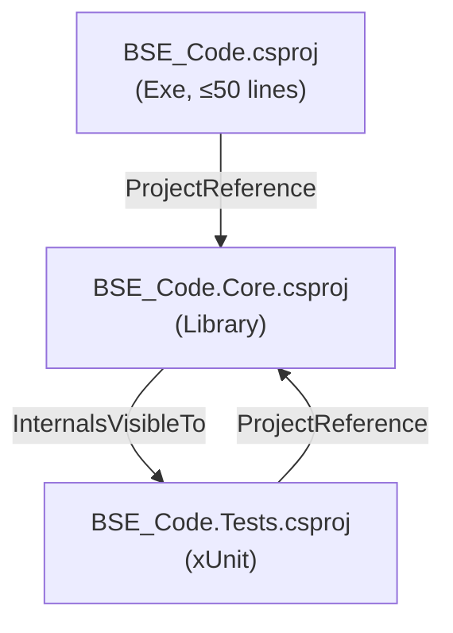

# Design Document: Codebase Quality Improvements

## Overview

This document describes the technical design for a set of targeted quality improvements to the BSE-Code .NET CLI tool. The changes fall into four categories:

1. **Test infrastructure** — extract a Core library so Coverlet can instrument it, extract `ReplEngine` from `Program.cs`, and add test coverage for `SlashCommandHandler`, `InteractiveInput`, `SessionManager`, `McpManager`, and `ConfigManager`.
2. **Runtime reliability** — fix `SessionManager` tool-message persistence, surface `McpManager` errors visibly, and validate `AppConfig.BaseUrl` at startup.
3. **Security documentation** — add security comments to `BashTool` and create `SECURITY.md`.
4. **Developer-experience polish** — make `cliff.toml` repository-agnostic, add a cross-platform PowerShell pre-commit hook, add a CI badge to `README.md`, and fix `dotnet format` compliance.

None of these changes alter any user-facing behaviour.

---

## Architecture

### Current Structure

```
BSE_Code.csproj  (Exe)
  └── src/**/*.cs  (compiled directly)

BSE_Code.Tests.csproj  (test)
  └── <Compile Include="../src/...">  (source files pulled in directly — no coverage)
```

The test project pulls source files in via `<Compile Include>` items. This means Coverlet instruments the test assembly, not the production assembly, so coverage data is unreliable.

### Target Structure

```
BSE_Code.Core.csproj  (Library)  ← NEW
  └── src/**/*.cs  (all non-entry-point source)

BSE_Code.csproj  (Exe)
  └── <ProjectReference> BSE_Code.Core  ← replaces direct compilation
  └── src/Program.cs  (≤50 lines, entry point only)

BSE_Code.Tests.csproj  (test)
  └── <ProjectReference> BSE_Code.Core  ← replaces all Compile includes
```

Coverlet now instruments `BSE_Code.Core.dll` directly, producing accurate coverage.



---

## Components and Interfaces

### 1. BSE_Code.Core Project (`src/BSE_Code.Core.csproj`)

New library project. Compiles all files currently listed under `<Compile Include="../src/...">` in the test project, plus the new `ReplEngine.cs`.

```xml
<Project Sdk="Microsoft.NET.Sdk">
  <PropertyGroup>
    <OutputType>Library</OutputType>
    <TargetFramework>net10.0</TargetFramework>
    <AssemblyName>BSE_Code.Core</AssemblyName>
    <RootNamespace>BSE_Code</RootNamespace>
    <ImplicitUsings>enable</ImplicitUsings>
    <Nullable>enable</Nullable>
  </PropertyGroup>

  <ItemGroup>
    <AssemblyAttribute Include="System.Runtime.CompilerServices.InternalsVisibleTo">
      <_Parameter1>BSE_Code.Tests</_Parameter1>
    </AssemblyAttribute>
  </ItemGroup>

  <ItemGroup>
    <PackageReference Include="OpenAI" Version="2.10.0" />
  </ItemGroup>
</Project>
```

The `BSE_Code.csproj` (Exe) adds a `<ProjectReference>` to Core and removes the `<Compile Remove="tests/**" />` guard (no longer needed since tests reference Core, not the Exe). The `[InternalsVisibleTo]` attribute moves from `BSE_Code.csproj` to `BSE_Code.Core.csproj`.

### 2. ReplEngine Class (`src/ReplEngine.cs`)

Extracted from `Program.cs`. Non-static, constructor-injected, lives in the Core library.

```csharp
public sealed class ReplEngine
{
    private readonly AppConfig _config;
    private readonly ToolRegistry _toolRegistry;
    private readonly Func<ChatClient> _buildClient;
    private readonly Func<string> _buildSystemPrompt;
    private readonly Func<ChatCompletionOptions> _buildOptions;

    public ReplEngine(
        AppConfig config,
        ToolRegistry toolRegistry,
        Func<ChatClient> buildClient,
        Func<string> buildSystemPrompt,
        Func<ChatCompletionOptions> buildOptions) { ... }

    // Entry points
    public Task RunAsync();                          // interactive REPL loop
    public Task RunOneShotAsync(string prompt, string outputFormat);

    // Testable methods (internal)
    internal Task RunTurnAsync(
        ChatClient client, ChatCompletionOptions opts,
        List<ChatMessage> messages, string userInput,
        StringBuilder? captureOutput = null);

    internal static string? InjectAtPath(string atPath, string rest);

    internal static async Task<string> HandleMcpToolAsync(string fullName, string argsJson);

    // Throws ArgumentException instead of Environment.Exit — testable
    internal static void ValidateUnknownFlags(string[] args, string? inlinePrompt, string? modelOverride);

    // UI helpers (internal)
    internal static void PrintBanner(string model, string provider);
    internal void PrintStats(List<ChatMessage> messages, DateTime sessionStart,
                             int sessionTurns, int sessionToolCalls);
    internal static void PrintToolCall(string name, string argsJson);
    internal static void PrintToolResult(string name, string result, bool success);
    internal static string? GetGitBranch();
    internal static string Truncate(string s, int max);
}
```

**Key change from current code**: `ValidateUnknownFlags` currently calls `Environment.Exit(1)` directly. In `ReplEngine` it will throw `ArgumentException` instead. `Program.cs` catches it and calls `Environment.Exit(1)`, preserving the user-facing behaviour while making the method unit-testable.

`Program.cs` after extraction (≤50 lines):

```csharp
// Bootstrap
Console.OutputEncoding = System.Text.Encoding.UTF8;

if (args.Contains("--version") || args.Contains("-v")) { /* print version */ return; }
if (args.Contains("--help")    || args.Contains("-h")) { /* print help */    return; }
if (args.Contains("--config"))  { await ConfigManager.LoadOrSetupAsync(true); return; }

// Parse flags
string? modelOverride = /* ... */;
string? themeOverride = /* ... */;
string  outputFormat  = /* ... */;
string? inlinePrompt  = /* ... */;

try { ReplEngine.ValidateUnknownFlags(args, inlinePrompt, modelOverride); }
catch (ArgumentException ex) { UI.Error(ex.Message); Environment.Exit(1); }

var config = await ConfigManager.LoadOrSetupAsync();
if (modelOverride is not null) config.Model = modelOverride;
ThemeManager.TrySet(themeOverride ?? config.Theme ?? "default");

// ... initialise managers ...

var engine = new ReplEngine(config, toolRegistry, BuildClient, BuildSystemPrompt, BuildOptions);

if (inlinePrompt is not null)
    await engine.RunOneShotAsync(inlinePrompt, outputFormat);
else
    await engine.RunAsync();
```

### 3. SlashCommandHandler Tests (`tests/SlashCommandHandlerTests.cs`)

`SlashCommandHandler` is already fully injectable via constructor `Func<>` delegates. Tests use in-memory `List<ChatMessage>` and stub delegates — no real `ChatClient` or file I/O required.

```csharp
public class SlashCommandHandlerTests
{
    private SlashCommandHandler MakeHandler(
        AppConfig? config = null,
        List<ChatMessage>? messages = null,
        Func<Task>? runTurn = null) { ... }

    [Fact] public async Task Clear_RemovesNonSystemMessages();
    [Fact] public async Task Clear_PreservesSystemMessage();
    [Fact] public async Task Model_WithArg_UpdatesConfigAndRebuildsClient();
    [Fact] public async Task Model_NoArg_PrintsCurrentModel();
    [Fact] public async Task Exit_ReturnsOne();
    [Fact] public async Task Quit_ReturnsOne();
    [Fact] public async Task UnknownCommand_NoSkill_ReturnsZero();
    [Fact] public async Task Save_WithTag_CallsSessionManagerSave();
    [Fact] public async Task Resume_WithTag_LoadsMessages();
    [Fact] public async Task Compact_FewerThanThreeUserMessages_PrintsMessageAndReturnsZero();
}
```

### 4. InteractiveInput Tests (`tests/InteractiveInputTests.cs`)

`GetSlashItems` is currently `private`. It will be changed to `internal` in the Core library, accessible via `InternalsVisibleTo`.

```csharp
public class InteractiveInputTests
{
    [Fact] public void History_NewLine_AddedAtEnd();
    [Fact] public void History_ConsecutiveDuplicate_StoredOnce();
    [Fact] public void History_NonConsecutiveDuplicate_BothStored();
    [Fact] public void GetSlashItems_EmptyFilter_ReturnsAllBuiltins();
    [Fact] public void GetSlashItems_MatchingFilter_ReturnsOnlyMatches();
    [Fact] public void GetSlashItems_NonMatchingFilter_ReturnsEmpty();
    [Fact] public void GetSlashItems_FilterIsCaseInsensitive();
}
```

Because `ReadLine()` is TTY-dependent, tests target the pure-logic helpers (`GetSlashItems`, history list manipulation) rather than the interactive loop itself.

### 5. SessionManager — Tool Message Persistence

#### Current Behaviour (Bug)

`Save()` filters to only `UserChatMessage | AssistantChatMessage` and strips `ToolChatMessage`. When an `AssistantChatMessage` contains tool calls, it is saved but its paired `ToolChatMessage` results are not. On `Resume()`, the OpenAI SDK receives an assistant message referencing tool call IDs with no corresponding tool results — this is an API protocol violation.

#### Fix Strategy: Strip Tool-Call Assistant Messages

The simplest correct fix is to also strip `AssistantChatMessage` entries that contain tool calls (i.e., where `ToolCalls.Count > 0`). This avoids the need to persist `ToolChatMessage` entries and keeps the saved session as a clean text-only conversation.

Rationale: tool-call exchanges are ephemeral — they represent the model's internal reasoning steps, not the conversation narrative. Stripping them produces a valid, resumable history.

#### Data Model Changes

`SavedMessage` requires no schema changes. The fix is purely in the `Save()` filter predicate:

```csharp
// Before
.Where(m => m is UserChatMessage or AssistantChatMessage)

// After
.Where(m => m switch {
    UserChatMessage                                          => true,
    AssistantChatMessage a when a.ToolCalls.Count == 0      => true,  // text-only assistant messages
    _                                                        => false
})
```

`Resume()` requires no changes — it already reconstructs `UserChatMessage` and `AssistantChatMessage` from the saved role/content pairs.

**Handling legacy/corrupt files**: If a session file on disk contains an `AssistantChatMessage` with tool calls (saved before this fix), `Resume()` will reconstruct it as a plain `AssistantChatMessage(content)`. Since the content field will be empty for tool-call-only messages, the `Where(!string.IsNullOrWhiteSpace(m.Content))` filter already in `Save()` will have excluded them. For any that slip through, `Resume()` produces a text-only assistant message with empty content — harmless.

### 6. BashTool Security Comments

`RunShell` gets an expanded XML doc comment:

```csharp
/// <summary>
/// Runs <paramref name="command"/> in the platform-appropriate shell
/// (cmd.exe on Windows, /bin/bash on Unix).
/// </summary>
/// <remarks>
/// <b>SECURITY WARNING:</b> This method executes arbitrary shell commands
/// supplied by the LLM without any input sanitization or sandboxing.
/// Callers are responsible for ensuring the command originates from a
/// trusted source (i.e., the user has reviewed and approved it).
/// Do not call this method with untrusted or unvalidated input.
/// </remarks>
```

`ExecuteAsync` gets an inline comment on the `command` extraction line:

```csharp
// WARNING: 'command' is passed directly to the platform shell without sanitization.
// The LLM constructs this value; ensure the user has approved the operation.
if (!args.TryGetValue("command", out var command) || ...)
```

### 7. McpManager Error Surfacing

`CallToolAsync` currently swallows exceptions silently. The fix adds a `UI.Warn` call in the catch block and for the null-response case:

```csharp
public static async Task<string> CallToolAsync(string serverName, string toolName, string argsJson)
{
    if (!_activeServers.TryGetValue(serverName, out var server))
        return $"❌ ERROR: MCP server '{serverName}' not found or disabled.";

    try
    {
        // ... existing call logic ...

        if (result is null)
        {
            UI.Warn($"🔌 MCP '{serverName}/{toolName}': no response (timeout or empty).");
            return "ERROR: No response from MCP server.";
        }

        // ... extract content ...
    }
    catch (Exception ex)
    {
        UI.Warn($"🔌 MCP '{serverName}/{toolName}' failed: {ex.Message}");
        return $"ERROR: {ex.Message}";
    }
}
```

`SendMcpRequestAsync` already throws on JSON-RPC error responses — no change needed there.

### 8. ConfigManager URL Validation

After loading the config and applying env var overrides, `LoadOrSetupAsync` validates `BaseUrl`:

```csharp
private static void ValidateBaseUrl(AppConfig config)
{
    if (string.IsNullOrWhiteSpace(config.BaseUrl)) return; // wizard will prompt
    if (!Uri.TryCreate(config.BaseUrl, UriKind.Absolute, out _))
    {
        Console.Error.WriteLine(
            $"❌ Invalid base URL: '{config.BaseUrl}'\n" +
            $"   Fix it in ~/.bse-code/config.json or via the BSE_BASE_URL environment variable.");
        Environment.Exit(1);
    }
}
```

Called in `LoadOrSetupAsync` after env var overrides are applied:

```csharp
if (!string.IsNullOrEmpty(envBase)) saved.BaseUrl = envBase;
ValidateBaseUrl(saved);   // ← new call
return saved;
```

Also called at the end of `RunSetupWizardAsync` before saving, so wizard-entered URLs are validated too.

### 9. cliff.toml Repository-Agnostic Template

Replace the hardcoded URL in the commit link template:

```toml
# Before
- {{ commit.message | upper_first }} ([{{ commit.id | truncate(length=7, end="") }}](https://github.com/BibleSocietyEg/bse-code/commit/{{ commit.id }}))

# After
- {{ commit.message | upper_first }} ([{{ commit.id | truncate(length=7, end="") }}](https://github.com/{{ remote.github.owner }}/{{ remote.github.repo }}/commit/{{ commit.id }}))
```

`git-cliff` derives `remote.github.owner` and `remote.github.repo` from the repository's configured `origin` remote at generation time.

### 10. Cross-Platform Pre-Commit Hook

New file `.githooks/pre-commit.ps1`:

```powershell
#!/usr/bin/env pwsh
# Pre-commit hook (PowerShell): verify code formatting and run tests.
# Install: git config core.hooksPath .githooks
# Then run: git config --global core.hooksPath .githooks

$ErrorActionPreference = 'Stop'

Write-Host "🔍 Checking code formatting..."
dotnet format --verify-no-changes --no-restore
if ($LASTEXITCODE -ne 0) {
    Write-Host ""
    Write-Host "❌ Formatting issues found. Run 'dotnet format' to fix them."
    exit 1
}

Write-Host "✅ Formatting OK"
Write-Host "🧪 Running tests..."
dotnet test tests/BSE_Code.Tests.csproj --no-restore -c Release --verbosity quiet
if ($LASTEXITCODE -ne 0) {
    Write-Host ""
    Write-Host "❌ Tests failed. Fix them before committing."
    exit 1
}

Write-Host "✅ All checks passed"
```

Update `.githooks/pre-commit` to detect Windows without a POSIX shell:

```sh
#!/bin/sh
# Pre-commit hook: verify code formatting and run tests.
# Install: git config core.hooksPath .githooks
#
# Windows users: if this script fails to run, use the PowerShell equivalent:
#   pwsh .githooks/pre-commit.ps1
# See CONTRIBUTING.md for details.

set -e
# ... existing content unchanged ...
```

`CONTRIBUTING.md` gets a new "Windows Contributors" section documenting how to install and use the PowerShell hook.

### 11. SECURITY.md

New file at repository root. Sections:

1. **Security-Sensitive Capabilities** — BashTool arbitrary shell execution, ReadFileTool/WriteFileTool arbitrary file access, MCP server subprocess spawning.
2. **Supported Versions** — latest published NuGet/npm release receives security fixes.
3. **Reporting a Vulnerability** — GitHub private security advisory link, expected acknowledgement within 7 days, fix timeline within 90 days for critical issues.
4. **Scope of Security Guarantees** — BSE-Code is a local developer tool; it intentionally executes commands the LLM requests. Users are responsible for reviewing tool calls before approving them.

### 12. dotnet format Compliance

Run `dotnet format` locally to fix all existing violations before the tasks are executed. The CI `lint` job already runs `dotnet format --verify-no-changes --no-restore` and the job ordering in `ci.yml` already has `lint` as a separate job from `test` — no CI changes needed.

### 13. CI Badge in README

Add to the badges section in `README.md`, after the existing npm badge:

```markdown
[](https://github.com/BibleSocietyEg/bse-code/actions/workflows/ci.yml)
```

---

## Data Models

### SavedMessage (unchanged schema)

```csharp
public class SavedMessage
{
    [JsonPropertyName("role")]    public string Role    { get; set; } = "";
    [JsonPropertyName("content")] public string Content { get; set; } = "";
}
```

No schema change is needed. The fix is in the `Save()` filter — tool-call assistant messages are excluded at save time rather than stored with an extended schema.

### AppConfig (unchanged schema)

```csharp
public class AppConfig
{
    [JsonPropertyName("base_url")] public string BaseUrl { get; set; } = "";
    // ... other properties unchanged ...
}
```

Validation is added at load time; the persisted format is unchanged.

---

## Correctness Properties

*A property is a characteristic or behavior that should hold true across all valid executions of a system — essentially, a formal statement about what the system should do. Properties serve as the bridge between human-readable specifications and machine-verifiable correctness guarantees.*

### Property 1: ValidateUnknownFlags rejects any unrecognised flag

*For any* string that starts with `--` or `-` and is not in the known flags set (`-p`, `--model`, `--theme`, `--output-format`, `--config`, `--version`, `-v`, `--help`, `-h`), calling `ReplEngine.ValidateUnknownFlags` with that string in the args array SHALL throw an `ArgumentException`.

**Validates: Requirements 2.3**

### Property 2: InjectAtPath wraps any file content in a fenced code block

*For any* file path pointing to an existing file with any content, `ReplEngine.InjectAtPath` SHALL return a non-null string that contains the file's content enclosed in a fenced code block (`` ``` ``).

**Validates: Requirements 2.4**

### Property 3: InjectAtPath caps directory injection at 20 files

*For any* directory path containing N files (where N > 0), `ReplEngine.InjectAtPath` SHALL return a string referencing at most 20 files, regardless of how large N is.

**Validates: Requirements 2.5**

### Property 4: /clear removes all non-system messages from any message list

*For any* `List<ChatMessage>` containing a mix of `SystemChatMessage`, `UserChatMessage`, and `AssistantChatMessage` entries, after `/clear` is handled, the list SHALL contain only `SystemChatMessage` entries.

**Validates: Requirements 3.2**

### Property 5: History deduplication invariant

*For any* sequence of submitted lines, the history list SHALL never contain the same string as two consecutive entries — submitting a line that is identical to the current last entry SHALL leave the history unchanged.

**Validates: Requirements 4.2, 4.3**

### Property 6: GetSlashItems filter returns only matching items

*For any* non-empty filter string, every item returned by `InteractiveInput.GetSlashItems(filter)` SHALL have a label or value that contains the filter string (case-insensitive). No item that does not match the filter SHALL appear in the result.

**Validates: Requirements 4.5**

### Property 7: Session save+resume round-trip produces no orphaned tool-call references

*For any* `List<ChatMessage>` (including messages with tool calls), saving via `SessionManager.Save` and then loading via `SessionManager.Resume` SHALL produce a list in which no `AssistantChatMessage` references a tool call ID that lacks a corresponding `ToolChatMessage` result.

**Validates: Requirements 5.1, 5.2**

### Property 8: McpManager always surfaces errors visibly

*For any* exception thrown during `McpManager.CallToolAsync`, the returned string SHALL start with `"ERROR: "` and `UI.Warn` SHALL have been called with a message describing the failure before the method returns.

**Validates: Requirements 7.1**

### Property 9: BaseUrl validation accepts valid URIs and rejects invalid ones

*For any* string value assigned to `AppConfig.BaseUrl` (whether from the config file or the `BSE_BASE_URL` environment variable): if the string is a valid absolute URI, `ConfigManager.LoadOrSetupAsync` SHALL return the config object without error; if the string is not a valid absolute URI, the process SHALL exit with a non-zero exit code.

**Validates: Requirements 8.1, 8.3, 8.5**

---

## Error Handling

| Component | Error Condition | Current Behaviour | New Behaviour |
|---|---|---|---|
| `ConfigManager` | `BaseUrl` is not a valid absolute URI | Cryptic exception on first API call | Print human-readable error, `Environment.Exit(1)` |
| `McpManager.CallToolAsync` | Exception during tool execution | Returns `"ERROR: {ex.Message}"` silently | Calls `UI.Warn(...)` then returns error string |
| `McpManager.CallToolAsync` | Null response (timeout) | Returns `"ERROR: No response..."` silently | Calls `UI.Warn(...)` then returns error string |
| `ReplEngine.ValidateUnknownFlags` | Unknown CLI flag | `UI.Error` + `Environment.Exit(1)` | Throws `ArgumentException` (caught in `Program.cs`) |
| `SessionManager.Resume` | Orphaned tool-call assistant message in file | Returns malformed history | Silently drops the orphaned message |

---

## Testing Strategy

### Unit Tests (example-based)

Specific scenarios and edge cases that complement the property tests:

- `ReplEngineTests`: `InjectAtPath` with missing path returns null; `ValidateUnknownFlags` with known flags does not throw; `ValidateUnknownFlags` with value arguments (e.g. `--model gpt-4o`) does not throw.
- `SlashCommandHandlerTests`: `/exit` returns 1; `/model <id>` updates config; `/compact` with <3 user messages returns 0 without calling `_runTurn`; unknown command returns 0.
- `InteractiveInputTests`: `GetSlashItems("")` returns all built-in commands; `GetSlashItems("nonexistent-xyz")` returns empty list.
- `SessionManagerTests`: session with only text messages round-trips unchanged; session file with orphaned tool-call message is handled gracefully on `Resume`.
- `McpManagerTests`: null response returns `"ERROR: No response..."` and calls `UI.Warn`; JSON-RPC error response causes `CallToolAsync` to return `"ERROR: ..."` and call `UI.Warn`.
- `ConfigManagerTests`: valid URL `"https://api.openai.com/v1"` passes validation; invalid URL `"not-a-url"` triggers exit path.

### Property-Based Tests

Using [FsCheck](https://fscheck.github.io/FsCheck/) (F#/C# property-based testing library) with a minimum of 100 iterations per property.

Each property test is tagged with a comment in the format:
`// Feature: codebase-quality-improvements, Property {N}: {property_text}`

| Property | Generator | Assertion |
|---|---|---|
| P1: ValidateUnknownFlags | Random strings starting with `--` or `-`, not in known set | `Assert.Throws<ArgumentException>` |
| P2: InjectAtPath file | Random file content written to temp file | Result contains content and `` ``` `` markers |
| P3: InjectAtPath directory | Temp directory with random N files (0–50) | Result references ≤20 files |
| P4: /clear | Random mix of message types | Post-clear list contains only `SystemChatMessage` |
| P5: History deduplication | Random sequences of strings including consecutive duplicates | History never has two identical consecutive entries |
| P6: GetSlashItems filter | Random filter strings | All returned items contain filter (case-insensitive) |
| P7: Session round-trip | Random message lists including tool-call sequences | Resumed list has no orphaned tool-call references |
| P8: McpManager error surfacing | Random exception messages | Return starts with `"ERROR: "`, `UI.Warn` called |
| P9: BaseUrl validation | Random strings; valid URIs from generator | Valid URIs pass, invalid strings trigger exit |

### Integration Tests

- Build verification: `dotnet build BSE_Code.sln` exits 0 with no errors.
- Coverage verification: `dotnet test --collect:"XPlat Code Coverage"` produces `coverage.cobertura.xml` with >0% line coverage for `BSE_Code.Core`.
- Format verification: `dotnet format --verify-no-changes` exits 0.

### Not Tested (by design)

- `BashTool` security comments — documentation review only.
- `SECURITY.md` content — documentation review only.
- `cliff.toml` template variables — manual `git-cliff` dry-run.
- CI badge display — verified by triggering a CI run.
- Pre-commit hook exit codes — manual execution on each platform.
